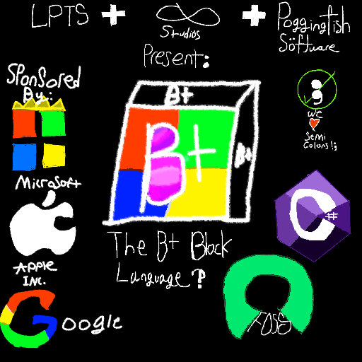

# B+ Programming Language.
### Created by ∞ Studios, Poggingfish Software and LPTS.

```
If kids can learn scratch in a matter of minutes, why not design every programming language that way? Why not make a language that anyone can pick-up and understand within minutes, instead of making a language that you need to go to college to learn.
```

Our sponsors
| Sponsor        | Link                  |
| -------------- | --------------------- |
| Microsoft      | https://microsoft.com |
| Apple          | https://apple.com     |
| Google         | https://google.com    |
